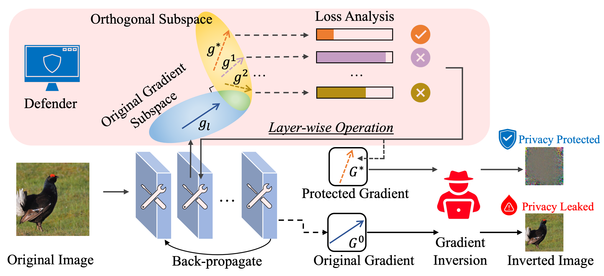
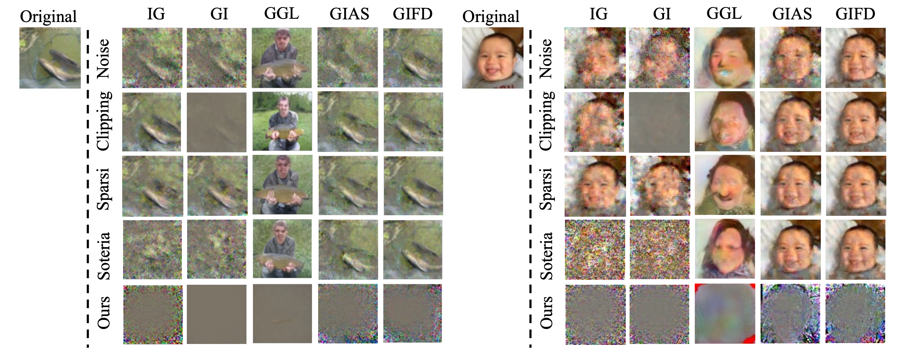

# CENSOR: Defense Against Gradient Inversion via Orthogonal Subspace Bayesian Sampling


Table of Contents
=================
- [Overview](#Overview)
- [Paper](https://kaiyuanzhang.com/publications/NDSS25_Censor.pdf)
- [Install required packages](#Install-required-packages)
- [Baselines](#Baselines)
- [Download models](#Download-models)
- [How to Run the Code](#How-to-Run-the-Code)
- [Citation](#Citation)
- [Acknowledgement](#Acknowledgement)
- [Special thanks to...](#Special-thanks-to)

## Overview
- This is the PyTorch implementation for NDSS 2025 paper "[CENSOR: Defense Against Gradient Inversion via Orthogonal Subspace Bayesian Sampling](https://kaiyuanzhang.com/publications/NDSS25_Censor.pdf)".  
- **Take-Away**: CENSOR perturbs gradients within a *subspace* **orthogonal** to the original gradient.



## Results


## Install required packages
```bash
# Create python environment (optional)
conda env create -f env.yml
conda activate censor 
```  

## Baselines
This repo contains the code for the following baselines:
- Attacks
  - IG: [Inverting gradients-how easy is it to break privacy in federated learning?](https://proceedings.neurips.cc/paper/2020/hash/c4ede56bbd98819ae6112b20ac6bf145-Abstract.html)
  - GI: [See through gradients: Image batch recovery via gradinversion](https://openaccess.thecvf.com/content/CVPR2021/html/Yin_See_Through_Gradients_Image_Batch_Recovery_via_GradInversion_CVPR_2021_paper.html)
  - GGL: [Auditing privacy defenses in federated learning via generative gradient leakage](https://openaccess.thecvf.com/content/CVPR2022/html/Li_Auditing_Privacy_Defenses_in_Federated_Learning_via_Generative_Gradient_Leakage_CVPR_2022_paper.html)
  - GIAS: [Gradient inversion with generative image prior](https://proceedings.neurips.cc/paper/2021/hash/fa84632d742f2729dc32ce8cb5d49733-Abstract.html)
  - GIFD: [Gifd: A generative gradient inversion method with feature domain optimization](https://openaccess.thecvf.com/content/ICCV2023/html/Fang_GIFD_A_Generative_Gradient_Inversion_Method_with_Feature_Domain_Optimization_ICCV_2023_paper.html)
- Defenses
  - Noise: [Differentially private federated learning: A client level perspective](https://arxiv.org/abs/1712.07557)
  - Clipping: [Gradient-leakage resilient federated learning](https://arxiv.org/abs/2107.01154)
  - Sparcification: [Sparse Communication for Distributed Gradient Descent](https://arxiv.org/abs/1704.05021)
  - Soteria: [Soteria: Provable Defense Against Privacy Leakage in Federated Learning From Representation Perspective](https://openaccess.thecvf.com/content/CVPR2021/html/Sun_Soteria_Provable_Defense_Against_Privacy_Leakage_in_Federated_Learning_From_CVPR_2021_paper.html)
  - CENSOR (Ours): [CENSOR: Defense Against Gradient Inversion via Orthogonal Subspace Bayesian Sampling](https://kaiyuanzhang.com/publications/NDSS25_Censor.pdf)


## Download models
  - download the `shape_predictor_68_face_landmarks.dat` from [here](https://drive.google.com/drive/folders/1B2I-1cXbvoYlMK-dSUsXwSuNo9LhcV1V?usp=sharing) to the root `censor` directory.
  - download the `stylegan2-ffhq-config-f.pt` from [here](https://drive.google.com/drive/folders/1B2I-1cXbvoYlMK-dSUsXwSuNo9LhcV1V?usp=sharing) to the `/inversefed/genmodels/stylegan2_io/` directory.


## How to Run the Code
```bash
python run_rec.py --config $CONFIG_PATH
```

Example command for evaluating CENSOR with BigGAN:
```bash
python run_rec.py --config configs_biggan.yml
```

## Citation
Please cite our work as follows for any purpose of usage.
```bibtex
@inproceedings{zhang2025censor,
  title={CENSOR: Defense Against Gradient Inversion via Orthogonal Subspace Bayesian Sampling},
  author={Zhang, Kaiyuan and Cheng, Siyuan and Shen, Guangyu and Ribeiro, Bruno and An, Shengwei and Chen, Pin-Yu and Zhang, Xiangyu and Li, Ninghui},
  booktitle={32nd Annual Network and Distributed System Security Symposium, {NDSS} 2025},
  year = {2025},
}
```

## Acknowledgement
Part of the code is adapted from the following repos. We express great gratitude for their contribution to our community!
- [Inverting Gradients](https://github.com/JonasGeiping/invertinggradients)  
- [ILO](https://github.com/giannisdaras/ilo)  
- [GGL](https://github.com/zhuohangli/GGL)  
- [GIFD_Gradient_Inversion_Attack](https://github.com/ffhibnese/GIFD_Gradient_Inversion_Attack)

The BigGAN implementation, we use PyTorch official [implementation and weights](https://github.com/rosinality/stylegan2-pytorch). For StyleGAN2, we adapt this [Pytorch implementation](https://github.com/rosinality/stylegan2-pytorch), which is based on the [official Tensorflow code](https://github.com/NVlabs/stylegan2).
